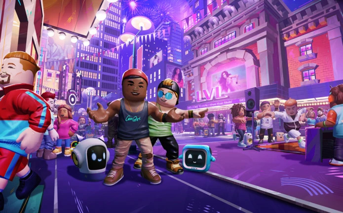
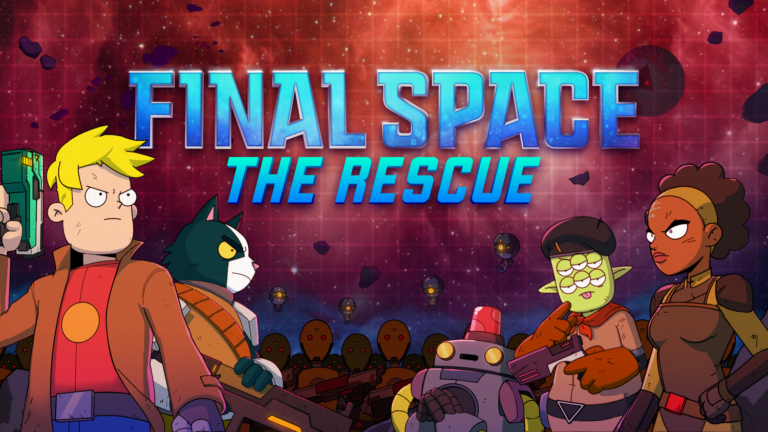
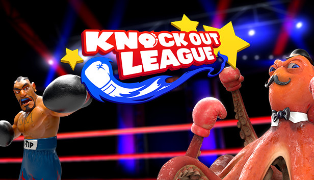
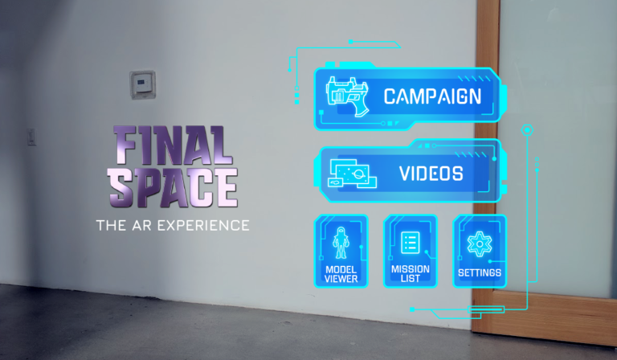

# Harrison Leon - Portfolio

## Fortnite - Sleepy Hollow Concert (2025)

Live event virtual concert built on the Fortnite platform

### Features
- Worked with design to create a design-doc template for implementing musical gameplay features
- Universal music sync timeline for synchronizing environmental effects with music
- Developed a scalable tech-art pipeline for importing 3D assets, motion capture data, and audio into Unreal Engine 5, supporting scaling and optimization between Unreal Engine and UEFN

### Engine/Technologies
- Unreal Engine 5
- C++ 
- UEFN
- Verse

### Platforms:
- Windows
- PlayStation
- Xbox
- Switch 
- Android

### Links
[Official Trailer](https://www.youtube.com/watch?v=j009EK8vkl0)

---

## Fortnite - Myles Smith Concert (2024)

Live event virtual concert built on the Fortnite platform

### Features
- Worked with design to create a design-doc template for implementing musical gameplay features
- Universal music sync timeline for synchronizing environmental effects with music
- Developed a scalable tech-art pipeline for importing 3D assets, motion capture data, and audio into Unreal Engine 5, supporting scaling and optimization between Unreal Engine and UEFN

Engine/Technologies:
- Unreal Engine 5
- C++
- UEFN
- Verse

Platforms: Windows PlayStation Xbox Switch Android

### Links
[Official Trailer](https://www.youtube.com/watch?v=aQUp1IfpEbo)

---

## AVNU: Where Music Meets (2024)

Social game and event space for promoting new and upcoming music artists

### Features
- All UI and menus
- Rhythm game implementation (music sync, scoring, timings)
- Tool for designing song charts for DLC songs
- Challenges and rewards

Engine/Technologies:
- Roblox 
- Lua 
- Python

Platforms:
- Windows
- macOS
- iOS
- Android

### Links
[Roblox Store Page](https://www.roblox.com/games/17659529447)

---

## Final Space VR – The Rescue (2022)

Multiplayer, co-op, first-person-shooter in VR

### Features
- All UI implementations (menus, lobby, settings, ammo, health bars)
- Physics based weapon systems
- Inventory system
- Multiplayer network code for interacting with and throwing objects in VR
- Enemy AI and behavior trees

Engine/Technologies:
- Unreal Engine 4
- C++

Platforms:
- Windows
- Oculus/Meta
- PlayStation 4

### Links
[Official Trailer](https://www.youtube.com/watch?v=ymZ-3ypGiCI)

[Steam Store Page](https://store.steampowered.com/app/1867580/Final_Space__The_Rescue/) | [Meta Store Page](https://www.meta.com/experiences/final-space-vr-the-rescue/5352920984748732/)

---

## Knockout League (Oculus Quest Port) (2019)

Arcade boxing game in VR

### Features
- Optimized game to run on mobile VR platforms

Engine/Technologies:
- Unreal Engine 4
- C++
- RenderDoc

Platforms:
- Windows
- Oculus/Meta
- PlayStation 4

### Links
[Official Trailer](https://www.youtube.com/watch?v=r9K-sPu_wwE)

[Steam Store Page](https://store.steampowered.com/app/488920/Knockout_League__Arcade_VR_Boxing/) | [Meta Store Page](https://www.meta.com/experiences/knockout-league/2078236868960051/)

---

## Final Space: The AR Experience (2019)

Twin-stick-shooter in AR

### Features
- All UI implementations (menus, lobby, settings, ammo, health bars)
- Enemy AI and behavior trees
- Player controls, health, and spawning

Engine/Technologies:
- Unity
- C#

Platforms:
- Magic Leap
